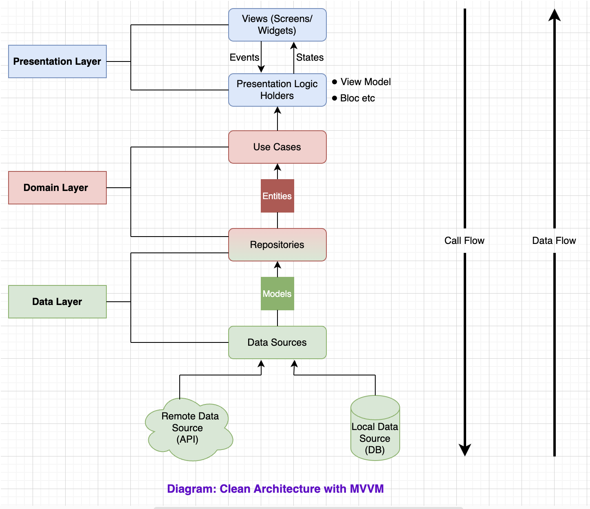
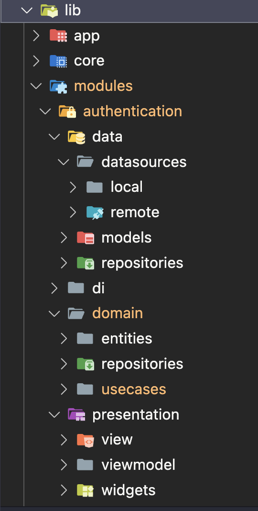

## Flutter Scaffold Template

## Overview

This is a Flutter project developed as a technical test by **Dalayya Kalla**. The project focuses on **Folder struture, MVVM architecture and Lib integrations**.

## Table of Contents

- [Architecture](#architecture)
- [Folder Structure](#folder-structure)
- [Libraries Used](libraries-used)

## Architecture

The Project is Based on MVVM and Clean-Architecture with consideration of SOLID principles.

## Folder Structure

We used Featured based folder structure than layer based.

Feature based - Layers (Data , domain and presentation) insdie features.
Layer based - Features inside layers.

**Data:** The data layer serves as a bridge between the domain layer and the presentation layer, supplying data through implementations of data sources, repositories, and models.

**Domain:** The domain layer encapsulates the core business logic and rules, acting as an intermediary between the data layer and presentation layer to ensure separation of concerns and maintain a clean, business-centric architecture.

**Presentation**: The presentation layer manages user interfaces and interactions, focusing on the visual representation of data and user experience. It relies on the domain layer for business logic and the data layer for data retrieval, fostering a clear separation of concerns in the application architecture.

## Libraries Used

- **Flutter**: Flutter is a UI toolkit that enables the creation of natively compiled applications for mobile, web, and desktop from a single codebase.

- **Retrofit and Dio** : for Networking.
- **Floor** : for Local Database.
- **Bloc and Cubit** : for State Management.
- **GetIt** : Dependancy Injection.
- **Shared Preferences** : for local storage.
- **Flutter Secure Storage** : for secure storage.
- **Sizer** : for Responsive UI.
- **Provider** : for dynamic UI updates.
